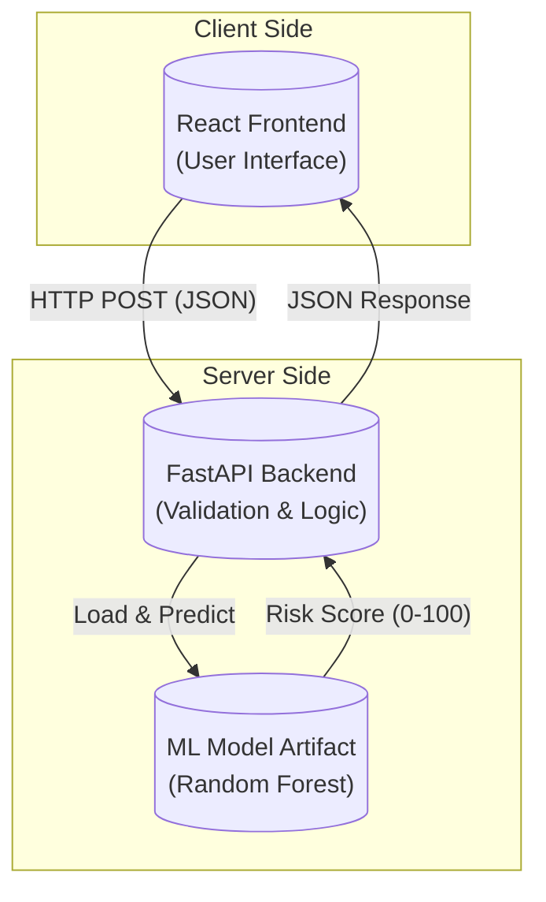
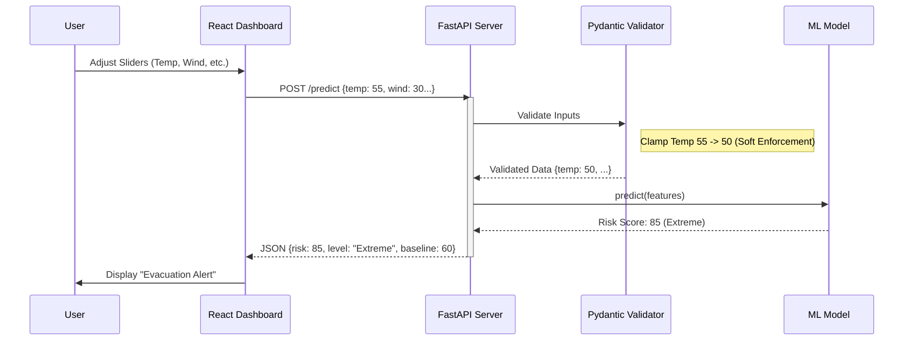
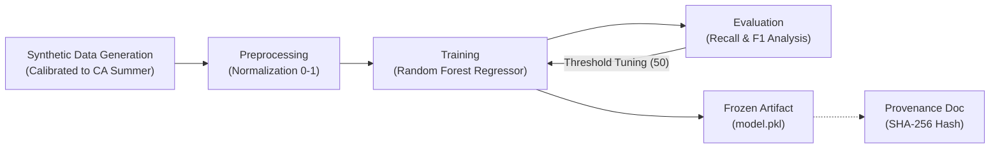
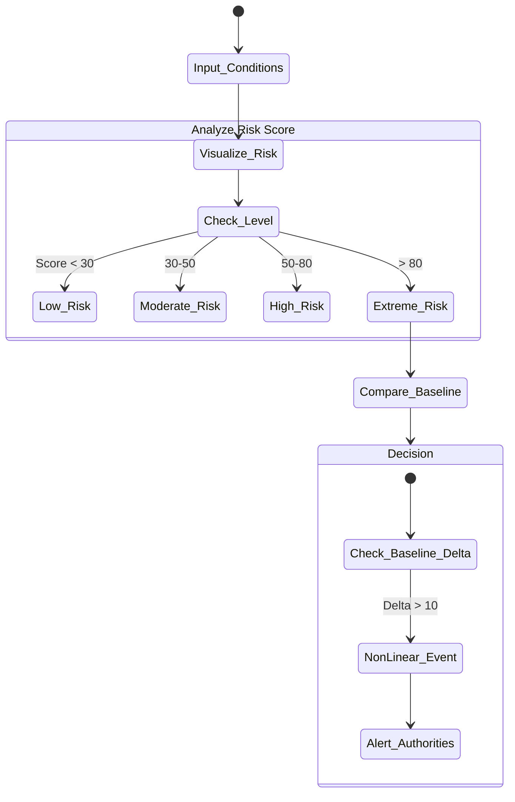

# GeoFireNet: Academic Diagrams

> [!NOTE]
> This document contains the Mermaid definitions for the system's core architectural and process diagrams. These can be rendered directly in GitHub or any Markdown viewer supporting Mermaid.

## 1. System Architecture Diagram

High-level view of the application components and their interactions.

## 2. Data Flow Diagram (DFD)

Tracing the flow of information from user input to visualization.

## 3. ML Pipeline Diagram

The lineage of the machine learning model from data to frozen artifact.

## 4. Decision-Support Workflow

How an end-user utilizes the system for risk assessment.

