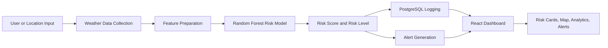
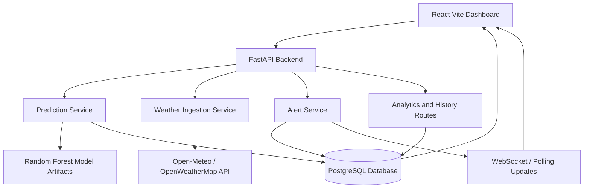
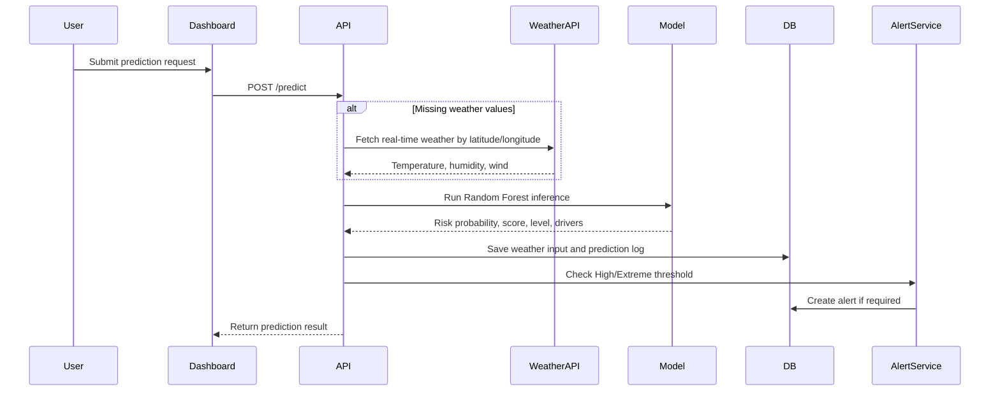
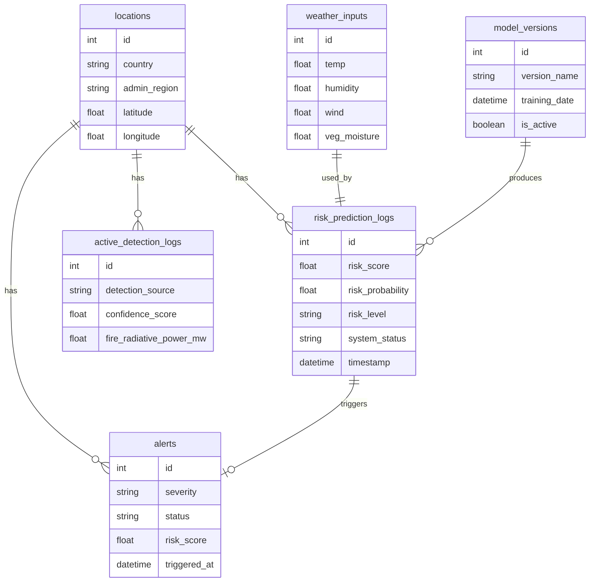
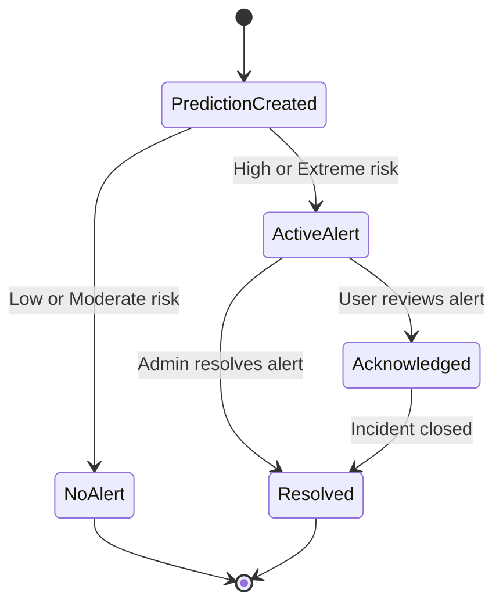

# GeoFireNet Final Report Figure Guide

## Overall Project Idea

GeoFireNet is an AI-assisted wildfire risk prediction and alerting platform. The system combines environmental weather inputs, machine learning inference, database logging, map visualization, analytics, and alert management into one dashboard. Its main goal is to help users identify high-risk fire conditions early, view affected regions on a map, and manage generated alerts.

The project is built as a full-stack system:

- **Frontend:** React and Vite dashboard with prediction forms, live map, analytics, history, settings, user access, and alert center.
- **Backend:** FastAPI REST API with routes for prediction, weather ingestion, alerts, analytics, history, detections, model details, and health checks.
- **Machine Learning:** Random Forest wildfire risk classifier using temperature, humidity, wind speed, vegetation moisture, and engineered interaction features.
- **Database:** PostgreSQL with SQLAlchemy models and Alembic migrations for locations, weather inputs, prediction logs, alerts, model versions, active detections, system logs, and settings.
- **External Data:** Open-Meteo or OpenWeatherMap weather API for real-time environmental data.
- **Visualization:** Leaflet maps, Chart.js analytics, dashboard cards, risk trends, alert lists, and risk distribution charts.

In simple terms, GeoFireNet receives weather or location data, calculates wildfire risk using a trained ML model, stores the result, generates alerts for high-risk conditions, and displays the information through an interactive dashboard.

## Recommended Figures for the Final Report

| Figure No. | Figure Title | Where to Add | What It Should Show | Brief Details / Caption |
| :--- | :--- | :--- | :--- | :--- |
| **Figure 1** | GeoFireNet Project Overview | Introduction / Project Overview | One high-level diagram showing data sources, ML prediction, backend API, database, dashboard, map, and alerts. | This figure gives the reader a quick understanding of the complete project. It should show how weather data and user inputs flow into the prediction model and become visual risk information. |
| **Figure 2** | System Architecture Diagram | System Design / Architecture | React dashboard, FastAPI backend, prediction service, alert service, PostgreSQL database, external weather API, and WebSocket or polling updates. | Use this to explain the main software components and how they communicate. This is one of the most important figures in the report. |
| **Figure 3** | Prediction Workflow Diagram | Methodology / System Workflow | User input or location coordinates -> weather ingestion -> feature preparation -> Random Forest model -> risk score -> database save -> alert generation. | This figure explains the core logic of the wildfire risk prediction process step by step. |
| **Figure 4** | Machine Learning Pipeline | Machine Learning Design | Dataset loading, feature engineering, preprocessing, model training, threshold calibration, evaluation, and saved artifacts. | This should show how the ML model was created and prepared for use inside the API. Include model type: Random Forest Classifier. |
| **Figure 5** | Database Entity Relationship Diagram | Database Design | Tables such as `locations`, `weather_inputs`, `risk_prediction_logs`, `alerts`, `model_versions`, `active_detection_logs`, `system_logs`, and `system_settings`. | This proves that the project has a structured persistence layer and supports traceability from input weather data to prediction logs and alerts. |
| **Figure 6** | Dashboard Overview Screenshot | Implementation / User Interface | Main dashboard showing risk cards, project risk map, risk forecast chart, and recent alerts. | This shows the central user interface and how users monitor overall wildfire risk. |
| **Figure 7** | Live Risk Map Screenshot | Implementation / Visualization | Leaflet map with colored risk markers and circular risk zones for USA and Australia scope. | This figure demonstrates spatial visualization. The caption should mention that marker colors represent Low, Moderate, High, and Extreme risk levels. |
| **Figure 8** | Prediction Form and Result Screenshot | Implementation / Prediction Module | Predictive modeller page with environmental input fields and generated result card. | Use this to show how a user submits weather conditions and receives a risk score, risk probability, level, confidence, and key drivers. |
| **Figure 9** | Alert Center Screenshot | Implementation / Alert Management | Alert summary cards, severity/status filters, alert list, and alert detail modal. | This figure explains how high and extreme predictions become actionable warnings that can be reviewed and resolved. |
| **Figure 10** | Analytics Dashboard Screenshot | Implementation / Analytics | Risk trend chart, risk distribution chart, KPIs, top risk drivers, and recent alerts feed. | This demonstrates that the system does more than single predictions; it also supports historical analysis and decision support. |
| **Figure 11** | Model Performance Comparison Chart | Results / ML Evaluation | Comparison between Random Forest, Logistic Regression, and Gradient Boosting using Accuracy, Precision, Recall, F1-score, and ROC-AUC. | This supports the reason for selecting Random Forest. Current artifacts show Random Forest accuracy of **90.0%** and ROC-AUC of **0.9654**. |
| **Figure 12** | Confusion Matrix | Results / ML Evaluation | True Positive, True Negative, False Positive, and False Negative counts. | Current evaluation values are TP = 159, TN = 381, FP = 30, FN = 30. This figure helps explain prediction correctness and error types. |
| **Figure 13** | Feature Importance Chart | Results / Explainability | Bar chart of feature importance for temperature, humidity, wind, vegetation moisture, and temperature-wind interaction. | Current artifact shows top contributors: temperature, temperature-wind interaction, vegetation moisture, humidity, and wind. This improves model explainability. |
| **Figure 14** | Alert Lifecycle Diagram | System Behavior / Alert Module | Prediction created -> High/Extreme risk detected -> alert generated -> active -> acknowledged/resolved. | This figure explains the incident response process and alert status transitions. |
| **Figure 15** | Testing Strategy Summary | Testing / Evaluation | Functional, integration, performance, reliability, usability, security, and ML accuracy testing areas. | This helps summarize the full validation approach used for the final year project. |

## Priority Figures

If the report has limited space, include these figures first:

1. **GeoFireNet Project Overview**
2. **System Architecture Diagram**
3. **Prediction Workflow Diagram**
4. **Machine Learning Pipeline**
5. **Database ER Diagram**
6. **Dashboard Overview Screenshot**
7. **Live Risk Map Screenshot**
8. **Model Performance Comparison Chart**
9. **Confusion Matrix**
10. **Feature Importance Chart**

These ten figures cover the complete project story: what the system is, how it works, how it was built, how users interact with it, and how well the model performs.

## Ready-to-Use Figure Drafts

### Figure 1: GeoFireNet Project Overview

**Caption:** Overall GeoFireNet workflow from environmental data collection to ML prediction, database storage, alert generation, and dashboard visualization.

### Figure 2: System Architecture Diagram

**Caption:** GeoFireNet system architecture showing communication between the React frontend, FastAPI backend, ML services, external weather provider, and PostgreSQL database.

### Figure 3: Prediction Workflow Diagram

**Caption:** End-to-end prediction workflow showing how user inputs or real-time weather data are converted into wildfire risk predictions and alerts.

### Figure 4: Machine Learning Pipeline

```mermaid
flowchart LR
    A[Dataset] --> B[Data Cleaning]
    B --> C[Feature Engineering]
    C --> D[Preprocessing]
    D --> E[Train Candidate Models]
    E --> F[Evaluate Metrics]
    F --> G[Select Random Forest]
    G --> H[Calibrate Risk Thresholds]
    H --> I[Save Model Artifacts]
    I --> J[FastAPI Prediction Service]
```

**Caption:** Machine learning pipeline used to train, evaluate, calibrate, and deploy the wildfire risk prediction model.

### Figure 5: Database ER Diagram

**Caption:** GeoFireNet database structure showing how locations, weather inputs, prediction logs, model versions, active detections, and alerts are connected.

### Figure 14: Alert Lifecycle Diagram

**Caption:** Alert lifecycle in GeoFireNet from prediction creation to active alert handling and resolution.

## Suggested Figure Captions for Screenshots

- **Dashboard Overview:** Main GeoFireNet dashboard displaying wildfire risk metrics, map-based risk zones, forecast trend, and recent alerts.
- **Live Risk Map:** Geographic visualization of wildfire risk zones using colored markers and circular overlays.
- **Prediction Module:** Manual prediction interface where environmental inputs are submitted to the ML model and converted into risk results.
- **Alert Center:** Alert management screen showing active warning counts, severity filters, alert records, and resolution controls.
- **Analytics Page:** Analytical view of prediction history, risk distribution, high-risk ratio, top drivers, and recent alert activity.
- **History Page:** Stored prediction history used for traceability and review of previous risk assessments.

## Charts to Generate from Existing Artifacts

The following files already contain useful values for final-report figures:

| Artifact File | Suggested Figure | Data to Use |
| :--- | :--- | :--- |
| `backend/artifacts/model_comparison.json` | Model Performance Comparison Chart | Accuracy, Precision, Recall, F1-Score, ROC-AUC for candidate models. |
| `backend/artifacts/confusion_matrix_values.json` | Confusion Matrix | TP, TN, FP, FN values. |
| `backend/artifacts/feature_importance.json` | Feature Importance Chart | Importance values for weather and engineered features. |
| `backend/artifacts/cross_validation_results.json` | Cross-Validation Stability Chart | Fold scores, mean score, and standard deviation. |
| `backend/artifacts/evaluation_results.json` | Evaluation Summary Figure | Accuracy, precision, recall, F1-score, ROC-AUC, and PR-AUC. |
| `backend/artifacts/thresholds.json` | Risk Threshold Calibration Figure | Low, Moderate, High, and Extreme probability thresholds. |

## Short Final Report Text

GeoFireNet is designed as a predictive wildfire risk monitoring system that connects machine learning, real-time environmental data, geospatial visualization, and alert management. The system accepts weather inputs manually or through real-time weather ingestion, processes them through a trained Random Forest model, and classifies wildfire risk into Low, Moderate, High, or Extreme levels. Each prediction is stored in PostgreSQL with its weather inputs, model version, timestamp, location, and key risk drivers. When the model identifies High or Extreme risk, the alert service generates an actionable alert that can be viewed and managed through the dashboard.

The final report should include figures that explain the project from both technical and user-facing perspectives. Architecture and workflow diagrams should be used to explain how the system is built, while screenshots should show the dashboard, map, prediction module, analytics page, and alert center. Model performance charts such as the confusion matrix, model comparison, and feature importance chart should be included in the evaluation section to prove that the ML component was tested and justified.

